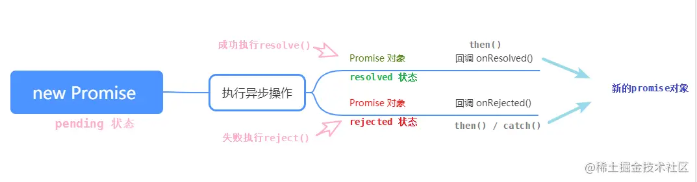

# Promise
> [Promise简述与用法](https://juejin.cn/post/7067851523035758600)   

> [promise用法解析](https://juejin.cn/post/6844903558517784583)    

Promise是JS中进行异步编程的新的解决方案    
js中异步编程的四种方法：回调函数、事件监听、发布/订阅、Promise对象,这里讨论promise的用法，promise是es6增加的内容，使得在异步编程中不用过多的嵌套回调函数，让异步操作变得更加简单

- promise 是一个构造函数
- Promise 的构造函数接收一个函数为参数，并且传入两个参数：resolve，reject，分别表示异步操作执行成功后的回调函数和异步操作执行失败后的回调函数。


## Promise基础定义 
### Promise.prototype.then 方法:
说明：.then() 方法用来**预先指定成功和失败**的回调函数，调用 .then() 方法时，成功的回调函数是必选的，失败的回调函数是可选的
``` js
Promise.prototype.then(onResolved, onRejected) => {}
onResolved 函数: 成功的回调函数 (value) => {} 
onRejected 函数: 失败的回调函数 (reason) => {} 

```
返回一个新的 promise 对象

### Promise.prototype.catch 方法:
说明：.catch() 方法用来捕获与处理错误 ，相当于 then(undefined, onRejected);

返回一个 失败 的 promise 对象
## Promise关键问题
1. 如何改变 promise 的状态?


- resolve(value): 如果当前是 pendding 就会变为 resolved

- reject(reason): 如果当前是 pendding 就会变为 rejected
- 抛出异常: 如果当前是 pendding 就会变为 rejected


2. 一个 promise 指定多个成功/失败回调函数, 都会调用吗?    
    当 promise 改变为对应状态时都会调用

3. 改变 promise 状态和指定回调函数谁先谁后?

- 都有可能, 正常情况下是先指定回调再改变状态, 但也可以先改状态再指定回调
- 如何先改状态再指定回调?

- 在执行器中直接调用 resolve()/reject()
- 延迟更长时间才调用 then()


- 什么时候才能得到数据?

  如果先指定的回调, 那当状态发生改变时, 回调函数就会调用, 得到数据    
  如果先改变的状态, 那当指定回调时, 回调函数就会调用, 得到数据

4. promise.then() 返回的新 promise 的结果状态由什么决定?


   1. 简单表达: 由 then()指定的回调函数执行的结果决定


     1. 详细表达:


        如果抛出异常, 新 promise 变为 rejected, reason 为抛出的异常


        如果返回的是非 promise 的任意值, 新 promise 变为 resolved, value 为返回的值


        如果返回的是另一个新 promise, 此 promise 的结果就会成为新 promise 的结果


1. promise 如何串连多个操作任务?


- promise 的 then()返回一个新的 promise, 可以开成 then()的链式调用


- 通过 then 的链式调用串连多个同步/异步任务


6. promise 异常传透?


- 当使用 promise 的 then 链式调用时, 可以在最后指定失败的回调,


- 前面任何操作出了异常, 都会传到最后失败的回调中处理


7. 中断 promise 链?


- 当使用 promise 的 then 链式调用时, 在中间中断, 不再调用后面的回调函数


- 办法: 在回调函数中返回一个 pendding 状态的 promise 对象
